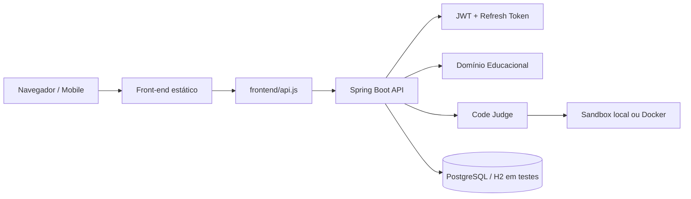

# Arquitetura

O AED Studio é organizado em duas camadas principais: uma API Spring Boot como fonte de verdade e um front-end estático que consome essa API pelo cliente central `frontend/api.js`.

## Visão de Alto Nível

## Camadas

| Camada | Responsabilidade |
|---|---|
| `controller` | Contratos HTTP, autenticação por usuário e entrada/saída da API |
| `service` | Regras de domínio: progresso, exercícios, simulações, judge, analytics e recomendações |
| `model` | Entidades persistidas |
| `repository` | Acesso a dados via Spring Data JPA |
| `dto` | Contratos explícitos entre API e front-end |
| `frontend/api.js` | Cliente HTTP central com base configurável e refresh automático |
| `frontend/aed-studio.html` | Experiência educacional, simuladores e renderização |

## Fonte de Verdade

O back-end mantém a fonte de verdade para:

- usuário autenticado;
- catálogo de tópicos e trilhas;
- pré-requisitos;
- progresso;
- XP e streak;
- badges;
- tentativas;
- exercícios gerados;
- missões de simulador;
- submissões de código;
- recomendações;
- analytics.

O front-end pode executar lógica visual, como animação de simuladores, mas eventos educacionais relevantes são enviados ao servidor.

## Domínio Educacional

O catálogo fica centralizado no back-end, evitando divergência de IDs entre interface e API. Cada tópico possui trilha, ordem, descrição, caminho e pré-requisitos.

Estados de tópico:

- `LOCKED`: pré-requisitos ainda não concluídos;
- `AVAILABLE`: liberado para estudo;
- `VISITED`: acessado pelo aluno;
- `COMPLETED`: critérios pedagógicos concluídos.

## Code Judge

O judge aceita assinaturas controladas e monta uma classe de execução segura em Java. O aluno envia apenas o corpo de `solve`.

Assinaturas atuais:

- `solve(int[] values)`
- `solve(String input)`
- `solve(int n)`
- `solve(int[] values, int target)`
- `solve(String[] values)`

Cada submissão é persistida como `CodeSubmission` e entra no histórico, analytics e recomendações.

## Ambiente de Teste E2E

O Playwright sobe automaticamente:

- back-end com perfil `e2e`;
- H2 em memória;
- servidor estático local para `frontend/`;
- Chromium headless.

Isso permite validar o fluxo real de navegador sem depender do PostgreSQL local.
