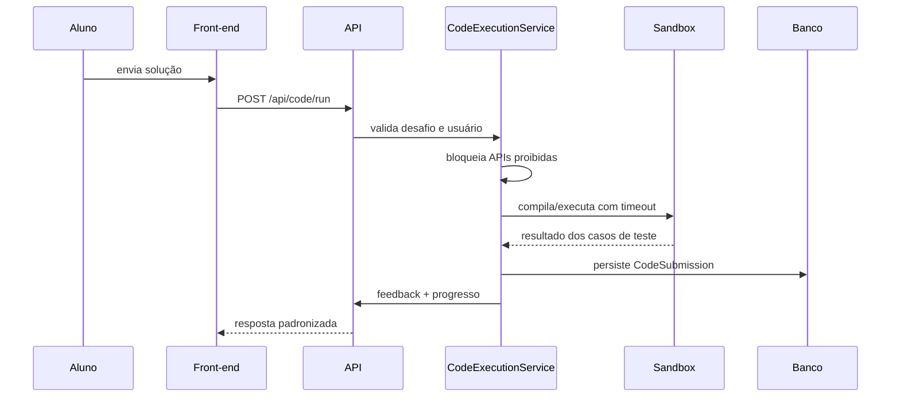

# Sandbox e Code Judge

O AED Studio possui um judge Java para exercícios de código com assinatura controlada. O objetivo é oferecer feedback pedagógico sem transformar o projeto em uma plataforma pública de execução arbitrária.

## Fluxo

## Modos

| Modo | Uso recomendado | Observação |
|---|---|---|
| `local` | desenvolvimento e testes | usa execução local controlada; não recomendado para ambiente público |
| `docker` | produção/demonstração pública | deve usar `--network none`, CPU/memória/PIDs limitados e timeout |

Variáveis:

- `CODE_SANDBOX_MODE`
- `CODE_SANDBOX_TIMEOUT_SECONDS`
- `CODE_SANDBOX_DOCKER_IMAGE`
- `CODE_SANDBOX_DOCKER_CPUS`
- `CODE_SANDBOX_DOCKER_MEMORY`
- `CODE_SANDBOX_DOCKER_PIDS_LIMIT`

## Medidas de Segurança Atuais

- assinatura esperada controlada por desafio;
- bloqueio preventivo de APIs perigosas;
- timeout de execução;
- persistência de submissão sem expor stacktrace sensível ao aluno;
- suporte a Docker como caminho recomendado para uso público;
- container sem rede quando executado em modo Docker.

## Riscos Conhecidos

- validação por substring não substitui sandbox forte;
- modo `local` deve ser usado somente em desenvolvimento;
- desafios multi-linguagem exigirão isolamento por linguagem;
- logs devem evitar código sensível em produção.

## Evolução Recomendada

1. tornar Docker obrigatório fora de `dev/test`;
2. separar judge em worker/processo isolado;
3. limitar tamanho de código e entrada;
4. adicionar fila de execução;
5. persistir métricas de timeout/compilação por desafio;
6. criar testes E2E específicos para erro de compilação, timeout e runtime error.
